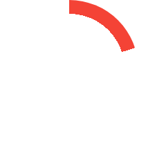
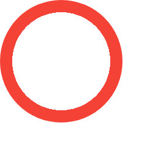

# 15. doughnut chart

### Problem

https://bigfrontend.dev/css/doughnut-chart

#

### Problem Description

Let's create a doughnut chart in CSS.

1. radius: 50px
2. thickness: 10px
3. color: `#f44336`

The percentage should be able to set by CSS variable `--percentage`.

For example, to create a doughnut chart with 20%:

```html
<div class="piechart" style="--percentage:20%"></div>
```

A doughnut chart with 75%:

```html
<div class="piechart" style="--percentage:75%"></div>
```

**1. percentage: 20%**

<kbd></kbd>

**2. percentage: 75%**

<kbd></kbd>

**3. percentage: 100%**

<kbd></kbd>

#

### Solution

```css
.piechart {
  width: 100px;
  height: 100px;
  clip-path: circle(50px at center);
  background: conic-gradient(#f44336 var(--percentage), transparent 0);

  /* Cut out a hollow circle */
  -webkit-mask: radial-gradient(
    closest-side circle at center,
    transparent 80%,
    #fff 80%
  );
  mask: radial-gradient(
    closest-side circle at center,
    transparent 80%,
    #fff 80%
  );
}
```

#

### Reference

[radial-gradient()](https://tympanus.net/codrops/css_reference/radial-gradient/)
