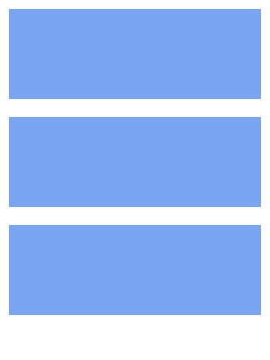
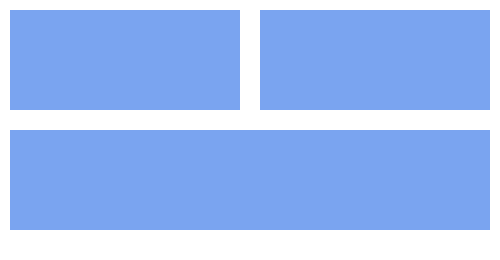

# 16. flex layout 1

### Problem

https://bigfrontend.dev/css/flex-layout-1

#

### Problem Description

Suppose we have to layout a bunch of items with below requirements.

1. Fill out to width:100px, but stretch to fill the available space and shrink if not enough
2. Stack them if needed

HTML structure is

```html
<div class="container">
  <div class="item"></div>
  <div class="item"></div>
  <div class="item"></div>
</div>
```

**1. width:60px**

<kbd></kbd>

**2. width:150px**

<kbd></kbd>

**3. width:250px**

<kbd></kbd>

**4. width:400px**

<kbd></kbd>

#

### Solution

```css
.container {
  display: flex;
  flex-wrap: wrap;
}

.item {
  background-color: #7aa4f0;
  height: 50px;
  margin: 5px;
  flex: 1 1 100px;
}
```

### Explanation

`flex` is the shorthand for `flex-glow`, `flex-shrink` and `flex-basis` combined.

The `flex-grow` property specifies how much of the available space in the flex container a flex item should take up. If all flex items have `flex-grow` set to `1`, the remaining space in the flex container will be assigned equally to all children.

The `flex-shrink` property specifies how flex items will shrink if the size of all flex items is larger than the flex container.

The `flex-basis` property sets the initial main size of a flex item. We set the `flex-basis` property on all the items to `100px`, meaning all the items will start at `100px`.

#

### Reference

- [A Complete Guide to Flexbox](https://css-tricks.com/snippets/css/a-guide-to-flexbox/)

- [flex-basis](https://developer.mozilla.org/en-US/docs/Web/CSS/flex-basis)

- [CSS width vs flex-basis](https://mastery.games/post/the-difference-between-width-and-flex-basis/)
