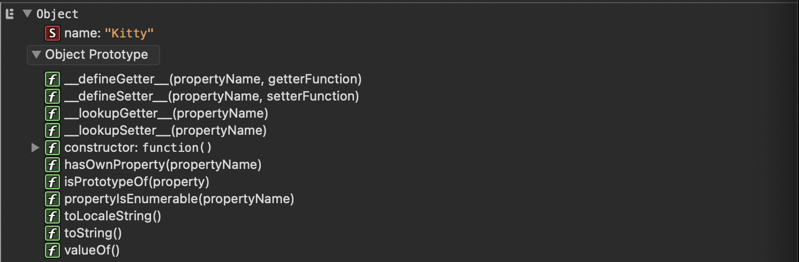

# 2. What is Prototypal Inheritance? How does it work?

### Problem

https://bigfrontend.dev/question/what-is-prototypal-inheritance-how-does-it-work

#

### Problem Description

It is hard to explain something clearly. I'd suggest you take a top-down approach for this kind of abstract concept.

for example.

generally what it is
what does it consist of , how does it work
what can we gain by using it
what we need to pay attention to .
....
If you are not familiar with Prototype, I recommend you first thoroughly read this article from JavaScript.info.

Good Luck!

#

### Solution

#### 1.What is Prototypal Inheritance?

##### - Prototype

Every objects contains a hidden property called Prototype. When we create a new object, Prototype is naturally included in this object.

```js
let cat = { name: "Kitty" };
console.dir(cat);
```

output:


A prototype in JavaScript is an object from which another object is derived from. It is very similar to the class in class based languages like Java. In Java, we can create a class which contains all the properties and methods defined inside the class. When a new object of this class is created, it has the access to the properties and the public methods defined inside the class.

```java
//Java
public class Cat {
    String name;
}

public static void main(String[] args) {
    Cat kitty = new Cat(); //kitty is a object of Cat class
    kitty.name = 'Kitty'; //kitty has the access to Cat class' property -- name
}
```

Prototype is very similar to the class which acts as the blueprint of the JavaScript objects. The newly created JavaScript object has access to all the properties and methods of the prototype from which the object is created in addition to its own properties and methods.

```js
let cat = { name: "Kitty" }; //cat object has properties and methods from its prototype object and properties and methods from its own
console.dir(cat);
```

##### - Prototype chaining

The prototype of an object would also hava a prototype object and this continues until we reach the top level when there is no prototype object. This is called prototype chaining.

<a href="https://www.sudshekhar.com/blog/prototype-and-prototype-chain-in-javascript">Prototype and prototype chain</a>

##### - Prototypal inheritance

Prototypal inheritance refers to the ability of an object to access properties and methods from its prototype, it follows the prototype chain and searches for the properties and methods. All objects inherit properties and methods from their prototype. Object.prototype is on top of the prototype inheritance chain.

```js
class Pet {
  constructor(name, age, type) {
    this.name = name;
    this.age = age;
    this.type = type;
  }
  say() {
    if (this.type === "dog") {
      console.log("woof");
    } else if (this.type === "cat") {
      console.log("meow");
    } else {
      console.log("hi");
    }
  }
}

class Cat extends Pet {
  constructor(name, age, type) {
    super(name, age);
    this.type = "cat";
  }
}

let cat = new Cat();
// cat object inherits Pet's method
cat.say();
// cat object inherits Object's method
cat.toString();
```

<a href="https://www.educative.io/blog/understanding-and-using-prototypal-inheritance-in-javascript#what-is">Understanding and using prototypal inheritance</a>

#### 2.How does Prototypal Inheritance work?

We can use \_\_proto\_\_ to set the prototype of an object.

```js
//ChildObject.__proto__ = ParentObject;
let pet = {
  name: "kitty",
  age: 1,
  type: "pet",
  say() {
    if (this.type === "cat") {
      console.log("meow");
    } else {
      console.log("idk");
    }
  },
};

let cat = {
  __proto__: pet,
};

cat.say(); //cat inherits pet
```

<a href="https://www.geeksforgeeks.org/prototypal-inheritance-using-__proto__-in-javascript/">Prototypal inheritance using \_\_proto\_\_</a>
