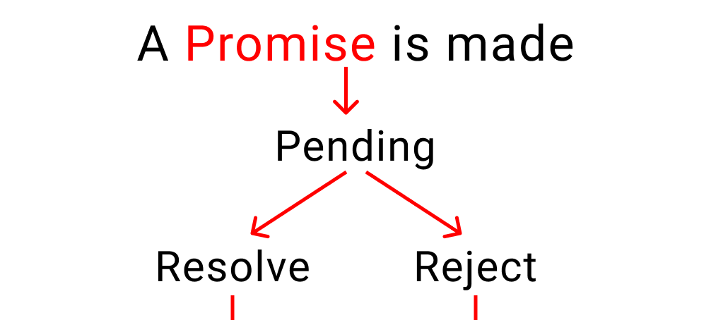

# 5.`var` vs `let` vs `const`

### Problem

https://bigfrontend.dev/question/Explain-the-concept-of-Promise-to-a-5-year-old

#

### Problem Description

A not-that-easy question.

Suppose you you a 5-year-old, what do you like the most and try to bind some Promise concept on that.

Do mention all the good stuff on Promise, like thenable, resolve/reject, error catching .etc

#

### Solution

Before explain promise, I want to first expain several other concepts which are also related to promise.

#### Synchronous JavaScript

In Synchronous JavaScript, only one operation can happen at a time because it is single-threaded. So, all other processes are put on hold while the current operation is executing.

#### Asynchronous JavaScript

Some functions in JavaScript don't response immediately, it may take a long time and the next operation cannot start immediately. It has to wait for the function to finish in the background. In this case, we need asynchronous JavaScript to enable the program to start this long-running task, and then rather than having to wait until that task has finished, to be able to continue to be responsive to other events while the task runs. Once the task is completed, the program is presented with the result.
<a href="https://www.geeksforgeeks.org/what-is-callback-hell-in-node-js/">Sync&Async JavaScript</a>

#### Asynchronous JavaScript -- 3 ways

<ul>
    <li>Callbacks</li>
    <li>Promises</li>
    <li>Async/Await</li>
</ul>

Then we'll use an example to explain callbacks, promises and async/await.

<b>1.Callbacks</b>
-What is a callback? ---When you nest a function inside another function as an argument, that's called a callback.

```js
// Callback illustrated
Function One() {
    //Do something
}
Function Two(call_One) {
    //Do something else
    call_One();
}

Two(One);
```

Let's look at the ice cream production example.
The customers will order an ice cream with its fruit, holder and topping. And we'll make it and serve the ice cream to him/her. The steps and time we need:


```js
// The ingredients we have
let stocks = {
  fruits: ["strawberry", "grapes", "banana", "apple"],
  liquid: ["water", "ice"],
  holder: ["cone", "cup", "stick"],
  toppings: ["chocolate", "peanuts"],
};
// Customer ordered
let order = (fruitName, holderName, toppingName, callProduction) => {
  // order finished.
  setTimeout(() => {
    console.log("Order placed. Please call production");
    setTimeout(() => {
      // start to produce the ice cream
      callProduction(fruitName, holderName, toppingName);
    }, 0000);
  }, 2000);
};
let production = (fruitName, holderName, toppingName) => {
  console.log("production has started");
  setTimeout(() => {
    console.log(`The ${fruitName} has been chopped`);
    setTimeout(() => {
      console.log(`${stocks.liquid[0]} and ${stocks.liquid[1]} Added`);
      setTimeout(() => {
        console.log("start the machine");
        setTimeout(() => {
          console.log(`Ice cream placed on ${holderName}`);
          setTimeout(() => {
            console.log(`${toppingName} as toppings`);
            setTimeout(() => {
              console.log("serve Ice cream");
            }, 2000);
          }, 3000);
        }, 2000);
      }, 1000);
    }, 1000);
  }, 2000);
  console.log("Waiting..."); //execute before the setTimeout code, async js
};
// A customer ordered an grape flavor ice cream hold by a cup and topping with peanuts
order(stocks.fruits[1], stocks.holder[1], stocks.toppings[1], production);
// output: 11s
// Order placed. Please call production
// production has started
// Waiting...
// The grapes has been chopped
// water and ice Added
// start the machine
// Ice cream placed on cup
// peanuts as toppings
// serve Ice cream
```

This pyramid shaped setTimeout function block is called `callback hell`. It makes developers hard to read and also hard to maintain.

<i>In real world asynchronous JavaScript programming, we usually use callbacks to communicate the results of asynchronous operations, like I/O operations.</i>

```js
fs.readdir(source, function (err, files) {
  if (err) {
    console.log("Error finding files: " + err);
  } else {
    files.forEach(function (filename, fileIndex) {
      console.log(filename);
      gm(source + filename).size(function (err, values) {
        if (err) {
          console.log("Error identifying file size: " + err);
        } else {
          console.log(filename + " : " + values);
          aspect = values.width / values.height;
          widths.forEach(
            function (width, widthIndex) {
              height = Math.round(width / aspect);
              console.log(
                "resizing " + filename + "to " + height + "x" + height
              );
              this.resize(width, height).write(
                dest + "w" + width + "_" + filename,
                function (err) {
                  if (err) console.log("Error writing file: " + err);
                }
              );
            }.bind(this)
          );
        }
      });
    });
  }
});
```

<a href="http://callbackhell.com">Callback hell</a>

`Promises` were invented to solve the problem of callback hell.

<b>2.Promises</b>
Promise is an object that may produce a single value some time in the future: either a resolved value, or an error. It has 3 states:

<ul>
    <li>Pending: Initial state, before the Promise succeeds or fails</li>
    <li>Resolved: Completed Promis</li>
    <li>Rejected: Failed Promise</li>
</ul>



We'll solve the callback hell in the example above with promises.

```js
let isShopOpen = true;
let order = (time, work) => {
  return new Promise((resolve, reject) => {
    if (isShopOpen) {
      setTimeout(() => {
        resolve(work());
      }, time);
    } else {
      reject(console.log("Our shop is closed"));
    }
  });
};
// step 1
order(2000, () => console.log("Order placed. Please call production"))
  // step 2
  .then(() => {
    return order(0000, () => console.log("production has started"));
  })

  // step 3
  .then(() => {
    return order(2000, () => console.log("Fruit has been chopped"));
  })

  // step 4
  .then(() => {
    return order(1000, () =>
      console.log(`${stocks.liquid[0]} and ${stocks.liquid[1]} added`)
    );
  })

  // step 5
  .then(() => {
    return order(1000, () => console.log("start the machine"));
  })

  // step 6
  .then(() => {
    return order(2000, () =>
      console.log(`ice cream placed on ${stocks.holder[1]}`)
    );
  })

  // step 7
  .then(() => {
    return order(3000, () => console.log(`${stocks.toppings[0]} as toppings`));
  })

  // Step 8
  .then(() => {
    return order(2000, () => console.log("Serve Ice Cream"));
  })

  .catch(() => {
    console.log("Customer left");
  })

  .finally(() => {
    console.log("end of day");
  });

// output
// Order placed. Please call production
// production has started
// Fruit has been chopped
// water and ice added
// start the machine
// ice cream placed on cup
// chocolate as toppings
// Serve Ice Cream
// end of day
// if isShopOpen = false, output
// Our shop is closed
// Customer left
// end of day
```

<b>3.Async/Await</b>

There is another way called async/await, it's the better way to write promises and it helps us keep our code simple and clean.
All you have to do is write the word `async` before any regular function and it becomes a promise.

```js
let isShopOpen = true;

function time(ms) {
  return new Promise((resolve, reject) => {
    if (isShopOpen) {
      setTimeout(resolve, ms);
    } else {
      reject(console.log("Shop is closed"));
    }
  });
}

async function kitchen() {
  try {
    await time(2000);
    console.log("Order placed. Please call production");

    await time(0000);
    console.log("production has started");

    await time(2000);
    console.log("fruit has been chopped");

    await time(1000);
    console.log(`${stocks.liquid[0]} and ${stocks.liquid[1]} added`);

    await time(1000);
    console.log("start the machine");

    await time(2000);
    console.log(`ice cream placed on ${stocks.holder[1]}`);

    await time(3000);
    console.log(`${stocks.toppings[0]} as toppings`);

    await time(2000);
    console.log("Serve Ice Cream");
  } catch (error) {
    console.log("customer left");
  } finally {
    console.log("end of day");
  }
}

kitchen();
// output
// Order placed. Please call production
// production has started
// fruit has been chopped
// water and ice added
// start the machine
// ice cream placed on cup
// chocolate as toppings
// Serve Ice Cream
// end of day
// if isShopOpen = false, output
// Shop is closed
// customer left
// end of day
```

<a href="https://www.freecodecamp.org/news/javascript-async-await-tutorial-learn-callbacks-promises-async-await-by-making-icecream/">callbacks, promises and async/await -- freecodecamp</a>

<!-- #### AJAX

AJAX stands for Asynchronous JavaScript And XML. It's not a programming language, it's an idea for developing better. With AJAX, we can:

<ul>
    <li>Read data from a web server - after a web page has loaded(Asynchronous)</li>
    <li>Update a web page without reloading the page</li>
</ul>

AJAX is a means of loading data from the server and selectively updating parts of a web page without reloading the whole page. What it does is make use of the browser's built-in XMLHttpRequest(XHR) object to send and receive information to and from a web server asynchronously, in the background, without blocking the page or interfering with the user's experience. -->
